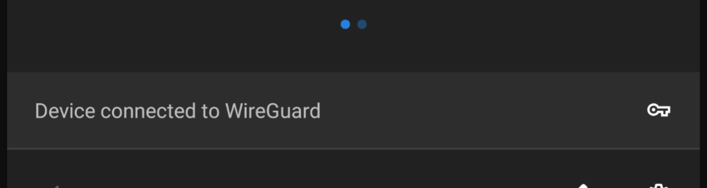

.. title: WireGuard + UniFi
.. slug: wireguard-+-unifi
.. date: 2019-02-07 22:52:26 UTC
.. tags: networking, vpn, unifi
.. category: networking
.. link:
.. description: Setting up a wireguard VPN instance on my UniFi Security Gateway
.. type: text
.. previewimage: ../../wireguard-logo.png

.. role:: bash(code)
   :language: bash

*****************
WireGuard + UniFi
*****************

I have been looking around for a good VPN solution to use on the road recently. I have a few
services running at home, that I really don't want on the internet (OctoPrint etc), but I want to use
remotely.

This is as much documentation for future me as it is for anyone who stumbles across this page :)

I had previously set up a L2TP Remote user VPN in the UniFi controller, but it had a few issues.

* Roaming problems on mobile
* Battery usage on mobile
* Slow Speeds

I had heard of Wireguard a while ago (I think they had a stall near the OpenStack stall in FOSDEM
last year), but I had completely forgotten about them. It turns out some kind soul has created a
deb package to install WireGuard on Vyatta (which is what the USG is based on).

.. TEASER_END

Installation
============

* Pick up the correct .deb from `here <https://github.com/Lochnair/vyatta-wireguard/releases>`_

  * :bash:`curl -sL https://github.com/Lochnair/vyatta-wireguard/releases/download/<version>/wireguard-<board>-<version>.deb -o wireguard-<board>-<version>.deb` worked for me
  * In my case, version was ``0.0.20190123-1`` and board was ``ugw3``

* :bash:`sudo dpkg -i wireguard-<board>-<version>-1.deb` to install the package
* :bash:`sudo -i` to make everything easier
* :bash:`umask 077 && mkdir wireguard && cd wireguard` for the server keys
* :bash:`wg genkey | tee wg_private.key | wg pubkey > wg_public.key` to create server keys
* :bash:`wg genkey | tee client1_private.key | wg pubkey > client1_public.key` to create the first client keys. You will need one of these keys for each client connecting to the VPN
* Then we move over to the UniFi controller to create the config for the VPN

config.gateway.json
===================

UniFi gateways are pretty similar to EdgeRouter products from Ubiquiti, with a crucial difference. Any config changes done from the CLI are wiped out on
reboots, or any config changes from the controller. the UniFi Controller is nice, but does not support the full range of EdgeOS features that we can use.

Thankfully there is a solution - ``config.gateway.json``. This file is layered over the base config that gets generated by UniFi, and allows much more control of a USG.

I created this file in my UniFi controller (for me, on Ubuntu the right location is ``/usr/lib/unifi/data/sites/<site-id>/config.gateway.json``).

.. code-block:: json

    {
        "firewall": {
            "group": {
                "network-group": {
                    "remote_user_vpn_network": {
                        "description": "Remote User VPN subnets",
                        "network": [
                            "10.255.252.0/24",
                        ]
                    }
                }
            }
        },
        "interfaces": {
            "wireguard": {
                "wg0": {
                    "description": "VPN for remote clients",
                    "address": [
                        "10.255.252.1/24"
                    ],
                    "firewall": {
                        "in": {
                            "name": "LAN_IN"
                        },
                        "local": {
                            "name": "LAN_LOCAL"
                        },
                        "out": {
                            "name": "LAN_OUT"
                        }
                    },
                    "listen-port": "443",
                    "mtu": "1352",
                    "peer": [
                        {
                            "<content of client1_public.key>": {
                                "allowed-ips":
                                [
                                    "10.255.252.2/32"
                                ],
                                "persistent-keepalive": 60
                            }
                        }
                    ],
                    "private-key": "/config/auth/wireguard/wg_private.key",
                    "route-allowed-ips": "true"
                }
            }
        }
    }

Client Configs
==============

Next up - lets add some client configs. First device I wanted to add (as I was
at home, and wanted to make sure this worked from outside the network, and is
the main device I seem to want remote access from) is my Android phone.

So, I created the following config:

.. code-block:: ini

    [Interface]
    PrivateKey = <content of client1_private.key>
    Address = 10.255.252.2/24
    DNS = <internal DNS Server>

    [Peer]
    PublicKey = <content of wg_public.key>
    Endpoint = <external-fqdn>:443
    AllowedIPs = <local subnets>, 10.255.252.0/24

Then :bash:`qrencode -t ansiutf8 < wireguard.conf` printed a qrcode on my console
that I could import the config into the Android `app`_

For my laptop, it is pretty easy as well, simply :bash:`brew install wireguard-tools`
and then create a similar file. We have to re run the :bash:`wg genkey | tee client1_private.key | wg pubkey > client1_public.key`
and add an extra peer to the ``config.gateway.json`` file, for each new client, but that is all the config we need.

Starting it all up
==================

You will also have to allow udp/443 to pass through the firewall. I created a
rule in the GUI that allows udp/443 on the WAN_LOCAL group.

Now, to force the provisioning for the USG, just go to your unifi controller, then find the
device. In the settings (the cog icon) for the device find the following section:

.. image:: ../../images/usg-provision.png

and trigger a force provision.

Then when it is deployed, you can start the tunnel on your end device!

To check if the wireguard service is actually listening, you can run netstat and
see if there is anything listening on udp/443

.. code-block:: console

    root@edge:~# netstat -npl | grep 443 | grep udp
    udp        0      0 0.0.0.0:443             0.0.0.0:*                           -
    udp6       0      0 :::443                  :::*                                -

You should see the following on the android settings pull down:

and on the USG, you can see the far side of the tunnel:

.. code-block:: console

    root@edge:~# show interfaces wireguard wg0 endpoints
    <content-of-client1_public.key file>    212.129.73.196:50453

On OSX, make sure the config file is named like an interface (wg0.conf etc), and run
:bash:`wg-quick up <path/to/config/file>` - and you will be connected.

Footnotes + Thanks
------------------

I did not figure any of this out myself - `mbello`_ filled in most of it from
his post on the `UniFi Forums`_

The OSX tooling was from a post called `Cheatsheet for setting up a WireGuard client on a Mac`_

This has been up for a day or so, and the roaming on mobile has been great. Even
when I walk into the house, and connect to the home network, the overhead is
so small, I don't notice any issues.

If I hit any issues, I will update this page with more details.

Happy VPNing!

.. _Cheatsheet for setting up a WireGuard client on a Mac: https://medium.com/@headquartershq/setting-up-wireguard-on-a-mac-8a121bfe9d86
.. _UniFi Forums: https://community.ubnt.com/t5/UniFi-Routing-Switching/WireGuard-VPN-server-setup-on-USG/m-p/2573407/highlight/true#M118707
.. _mbello: https://community.ubnt.com/t5/user/viewprofilepage/user-id/647439
.. _app: https://play.google.com/store/apps/details?id=com.wireguard.android